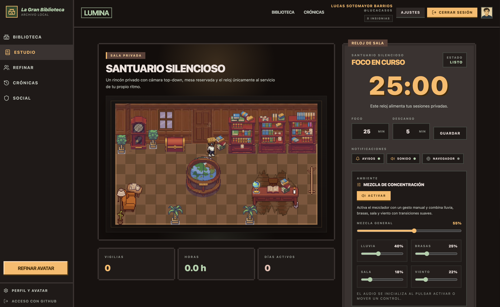
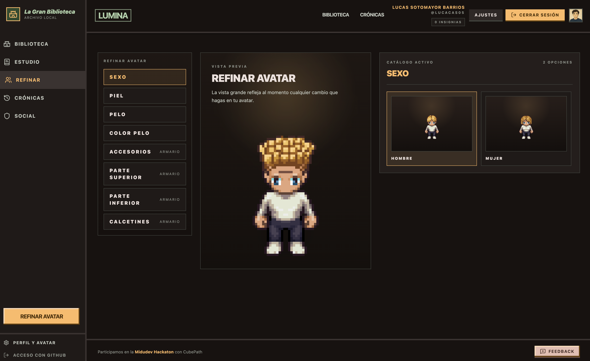

# Lumina

**Estudiar solo es aburrido. Lumina convierte las sesiones de estudio en una aventura compartida dentro de un santuario de fantasía.**

Lumina es una aplicación web que gamifica el estudio con temporizadores Pomodoro, presencia social en tiempo real, avatares personalizables y crónicas que crecen con cada sesión real. Pensada para hackathons y grupos de estudio que quieren mantenerse enfocados sin perder la diversión.

> **Demo en vivo:** <https://luminalibrary.duckdns.org/>

---

## Capturas de pantalla

<!-- Sustituye estos placeholders por capturas reales o GIFs del proyecto -->

|               Biblioteca central               |             Santuario silencioso             |          Editor de personaje           |
| :--------------------------------------------: | :------------------------------------------: | :------------------------------------: |
|  |  |  |

---

## Tech stack

| Capa          | Tecnología                            |
| ------------- | ------------------------------------- |
| Framework     | **Astro 5** (SSR + islas de React 19) |
| Lenguaje      | **TypeScript**                        |
| Estilos       | **Tailwind CSS 4**                    |
| Base de datos | **better-sqlite3**                    |
| Autenticación | **Arctic** (GitHub OAuth)             |
| Tiempo real   | **WebSocket (ws)**                    |
| Animaciones   | **GSAP**                              |
| Iconos        | **Lucide React**                      |
| Tests         | **Vitest**                            |

---

## Inicio rápido (< 5 minutos)

### Requisitos previos

- **Node.js 22 o 24** (el proyecto incluye `.nvmrc`)
- **npm**
- Opcionalmente, credenciales de GitHub OAuth para login (ver `.env.example`)

### 1. Clona e instala

```bash
git clone https://github.com/Lucacas05/Lumina.git
cd Lumina
cp .env.example .env   # edita las variables si necesitas OAuth
npm ci
```

### 2. Inicia el servidor de desarrollo

```bash
npm run dev
```

### 3. Abre el navegador

Visita [http://localhost:3000](http://localhost:3000) y explora el santuario.

---

## Variables de entorno

Copia `.env.example` a `.env` y completa según necesites:

| Variable                      | Descripción                                           | Requerida  |
| ----------------------------- | ----------------------------------------------------- | :--------: |
| `GITHUB_CLIENT_ID`            | ID de la app OAuth de GitHub                          | Para login |
| `GITHUB_CLIENT_SECRET`        | Secret de la app OAuth de GitHub                      | Para login |
| `SITE_URL`                    | URL base del sitio (default: `http://localhost:3000`) |     No     |
| `ADMIN_GITHUB_USERS`          | Usuarios GitHub con permisos de admin                 |     No     |
| `CUSTOM_WARDROBE_UPLOAD_ROOT` | Ruta raíz para subir assets de armario                |     No     |

---

## Scripts disponibles

| Comando             | Descripción                                |
| ------------------- | ------------------------------------------ |
| `npm run dev`       | Servidor de desarrollo en el puerto 3000   |
| `npm run build`     | Build de producción                        |
| `npm run start`     | Ejecuta el servidor de producción          |
| `npm run preview`   | Sirve el build de producción en local      |
| `npm run db:check`  | Valida integridad SQLite y claves foráneas |
| `npm run lint`      | Ejecuta `astro check` + ESLint             |
| `npm run lint:fix`  | ESLint con corrección automática           |
| `npm run format`    | Formatea el código con Prettier            |
| `npm run typecheck` | `tsc --noEmit`                             |
| `npm run test`      | Ejecuta tests con Vitest                   |
| `npm run clean`     | Elimina el directorio `dist`               |

---

## Características principales

- **Biblioteca central** como portal hacia los distintos espacios del santuario
- **Santuario silencioso** con temporizador Pomodoro editable
- **Biblioteca compartida y jardín** con presencia social en tiempo real vía WebSocket
- **Editor de personaje** modular para personalizar tu avatar
- **Crónicas e hitos** que crecen con sesiones reales de Pomodoro persistidas en SQLite
- **Rutas responsivas** en Astro con islas de React solo donde se necesita estado

---

## Estructura del proyecto

```text
src/
  components/     Bloques de interfaz reutilizables en Astro
  data/           Contenido centralizado y referencias de assets
  integrations/   Integraciones de Astro
  islands/        Islas interactivas de React
    sanctuary/    Componentes del santuario
  layouts/        Layouts compartidos
  lib/            Utilidades compartidas en runtime
    sanctuary/    Lógica de negocio del santuario, logros y misiones
    server/       Utilidades del servidor
  pages/          Rutas de Astro (estáticas y dinámicas)
    api/          Endpoints de la API
docs/             Notas de flujo de trabajo e integración
references/       Referencias visuales locales
scripts/          Scripts de build y despliegue
deploy/           Configuración de despliegue
```

---

## CI/CD

GitHub Actions ejecuta en cada `push` y `pull_request`:

```text
npm ci → lint → typecheck → test → build
```

El despliegue a VPS se gestiona con `.github/workflows/deploy.yml` (ver detalles en el workflow).

---

## Licencia

Consulta el archivo de licencia del repositorio.
